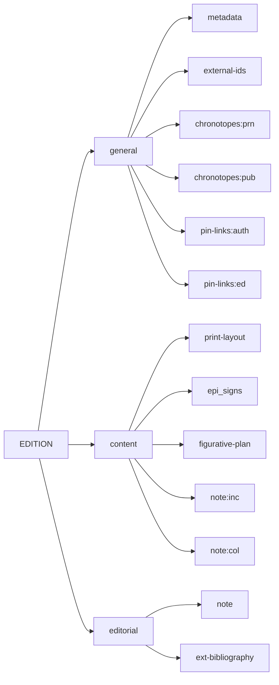
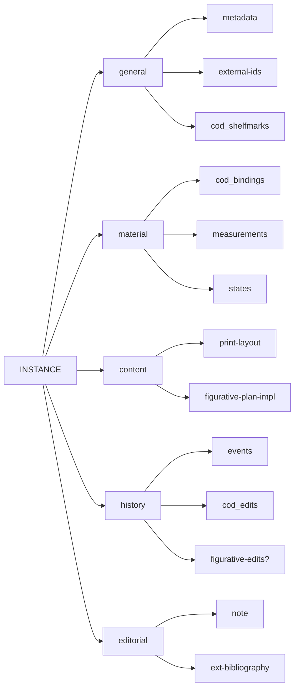

# Cadmus NDP Books

- [Cadmus models reference](https://myrmex.github.io/overview/cadmus/dev/models/)
- [Cadmus bricks playground](https://cadmus-bricks.fusi-soft.com/)
- [Cadmus NDP FRAC](https://github.com/vedph/cadmus-ndp-frac)
- [Cadmus NDP Drawings](https://github.com/vedph/cadmus-ndp-drawings)

In what follows:

- 🟢 marks a [general](https://vedph.github.io/cadmus-doc/models/shared.html#general) or bibliographic part.
- 📖 marks a [codicology](https://vedph.github.io/cadmus-doc/models/shared.html#codicology) part.
- 🪨 marks an [epigraphy](https://vedph.github.io/cadmus-doc/models/shared.html#epigraphy) part.
- ⭐ marks a new part. The star is used once, even when that part is then reused in other items. If a part marked with a star has a link to documentation, this means that I have already implemented it as I could do this in advance for generic parts. All the other parts are still to be implemented.
- ⚠️ marks an area where the model must still be defined with a discussion.

## New Parts

### PrintLayoutPart

Description of the print layout.

- ⭐ `PrintLayoutPart`:
  - `fonts` (`PrintFont[]`):
    - `family`\* (`string`): a descriptive ID like "R13" for the font family.
    - `ids` ([AssertedCompositeId[]](https://github.com/vedph/cadmus-bricks-shell-v3/blob/master/projects/myrmidon/cadmus-refs-asserted-ids/README.md#asserted-composite-ids)): external identifiers for the font.
    - `sections` (`string[]` 📚, fieldset): the section(s) where the font is used, e.g. title, body, note, etc.
    - `note` (`string`)
  - `sheetFormats` (`string[]` 📚)
  - `counts` (`DecoratedCount[]` 📚): counts for columns, sheets, etc.
  - `collation` (`string`: TODO: define a formula)
  - `features` (`string[]` 📚): various relevant features in layout like e.g. drop caps, framed text, etc.
  - `note` (`string`)

### FigurativePlanPart

Figurative plan.

- ⭐ `FigurativePlanPart`:
  - `artists` ([AssertedCompositeId[]](https://github.com/vedph/cadmus-bricks-shell-v3/blob/master/projects/myrmidon/cadmus-refs-asserted-ids/README.md#asserted-composite-ids)): artists identifiers, from external or internal resources, or even simple arbitrary names for unindentified artists.
  - `techniques` (`string[]` 📚)
  - `items` (`FigPlanItem[]`): ordered list of items (illustrations, initials, etc.):
    - `id` (`string`): a conventional human-friendly ID.
    - `type` (`string` 📚): type like illustration, initial, etc.
    - `citation` (`string`): this is a cross-project citation created according to some convention to link the figurative item to a textual passage.
  - `description` (`string`)
  - `features` (`string[]` 📚): any set of relevant features tagged for the plan.

### FigurativePlanImplPart

Implementation of a figurative plan.

- ⭐ `FigurativePlanImplPart`:
  - `complete` (`boolean`)
  - `techniques` (`string[]`) for override.
  - `items` (`FigPlanItemImpl[]`):
    - `id`\* (`string`): the ID of the corresponding figurative plan item, or a new one if added in this instance.
    - `location`\* (`string`): the page location.
    - `change`\* (`string`: 📚 `fig-plan-impl-changes`: none, added, deleted, replaced)
    - `features` (`string[]` 📚 `fig-plan-impl-item-features`): any relevant features of the implemented item, e.g. a frame.
    - `woodblockState`\* (`string` 📚 `fig-plan-impl-wb-states` e.g. good, fair, bad, etc.): the state of the woodblock used to print this item.
    - `woodblockStateDsc` (`string`): a free textual description of the woodblock state.
    - `position`\* (`string` 📚 `fig-plan-impl-positions`): the relative position of the item in the page, e.g. in-text, above column, etc.
    - `size` ([PhysicalSize](https://github.com/vedph/cadmus-bricks-shell-v3/blob/master/projects/myrmidon/cadmus-mat-physical-size/README.md))
    - `labels` (`string[]` 📚 `fig-plan-impl-labels`): the label types found in the item: e.g. a legend for the whole image, or a character name on a character in the image, etc.
    - `labelDsc` (`string`): a free textual description of image label(s).
    - `iconography` (`FigIconography`):
      - `subjects` (`string[]` 📚 `fig-plan-impl-subjects`): macrosoggetti.
      - `keywords` (`Keyword[]`):
        - `language` (`string`)
        - `value` (`string`)
      - `description` (`string`)
      - `citations` (`string[]`): any number of cross-project citation created according to some convention to link the figurative item to a textual passage.
      - `relatedIds` ([AssertedCompositeId[]](https://github.com/vedph/cadmus-bricks-shell-v3/blob/master/projects/myrmidon/cadmus-refs-asserted-ids/README.md#asserted-composite-ids)): IDs of related entities, whatever their type (persons, manuscripts, etc.).
  - `description` (`string`)
  - `features` (`string[]` 📚 `fig-plan-impl-features`)

## PrintEdition Item

The print edition is an abstraction, defined from at least 1 print instance.

- general:
  - 🟢 [MetadataPart](https://github.com/vedph/cadmus-general/blob/master/docs/metadata.md)
  - 🟢 [ExternalIdsPart](https://github.com/vedph/cadmus-general/blob/master/docs/external-ids.md)
  - 🟢 [ChronotopesPart:prn](https://github.com/vedph/cadmus-general/blob/master/docs/chronotopes.md) for printed
  - 🟢 [ChronotopesPart:pub](https://github.com/vedph/cadmus-general/blob/master/docs/chronotopes.md) for published
  - 🟢 [PinLinksPart](https://github.com/vedph/cadmus-general/blob/master/docs/pin-links.md)`:auth`: authors
  - 🟢 [PinLinksPart](https://github.com/vedph/cadmus-general/blob/master/docs/pin-links.md)`:ed`: editors

- content:
  - ⭐ [PrintLayoutPart](#printlayoutpart)
  - 🪨 [EPI EpiSignsPart](https://github.com/vedph/cadmus-epigraphy/blob/master/docs/epi-signs.md)
  - 🟢 [FigurativePlanPart](#figurativeplanpart)
  - 🟢 [NotePart:inc](https://github.com/vedph/cadmus-general/blob/master/docs/note.md) for incipit
  - 🟢 [NotePart:col](https://github.com/vedph/cadmus-general/blob/master/docs/note.md) for colophon

- editorial:
  - 🟢 [NotePart](https://github.com/vedph/cadmus-general/blob/master/docs/note.md) for generic note
  - 🟢 [ExtBibliographyPart](https://github.com/vedph/cadmus-general/blob/master/docs/ext-bibliography.md)

## PrintInstance Item

- general:
  - 🟢 [MetadataPart](https://github.com/vedph/cadmus-general/blob/master/docs/metadata.md)
  - 🟢 [ExternalIdsPart](https://github.com/vedph/cadmus-general/blob/master/docs/external-ids.md)
  - 📖 [COD shelfmarks](https://github.com/vedph/cadmus-codicology/blob/master/docs/cod-shelfmarks.md)

- material:
  - 📖 [COD bindings](https://github.com/vedph/cadmus-codicology/blob/master/docs/cod-bindings.md)
  - 🟢 [PhysicalMeasurementsPart](https://github.com/vedph/cadmus-general/blob/master/docs/physical-measurements.md)
  - 🟢 [PhysicalStatesPart](https://github.com/vedph/cadmus-general/blob/master/docs/physical-states.md)

- content:
  - ⭐ [PrintLayoutPart](#printlayoutpart) for overriding
  - ⭐ [FigurativePlanImplPart](#figurativeplanimplpart)

- history:
  - 🟢 [HistoricalEventsPart](https://github.com/vedph/cadmus-general/blob/master/docs/historical-events.md)
  - 📖 [COD CodEditsPart](https://github.com/vedph/cadmus-codicology/blob/master/docs/cod-edits.md) ❓ possibly change??
  - ❓ `FigurativeEditsPart`?? define something similar to CodEditsPart for the figurative layer.

- editorial:
  - 🟢 [NotePart](https://github.com/vedph/cadmus-general/blob/master/docs/note.md) for generic note
  - 🟢 [ExtBibliographyPart](https://github.com/vedph/cadmus-general/blob/master/docs/ext-bibliography.md)
