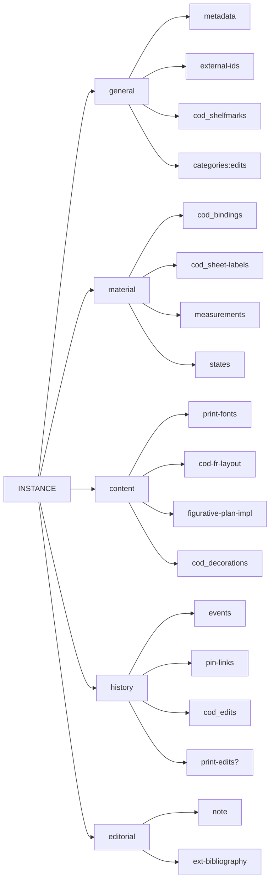

# Cadmus NDP Books

- [Cadmus models reference](https://myrmex.github.io/overview/cadmus/dev/models/)
- [Cadmus bricks playground](https://cadmus-bricks.fusi-soft.com/)
- [Cadmus NDP FRAC](https://github.com/vedph/cadmus-ndp-frac)
- [Cadmus NDP Drawings](https://github.com/vedph/cadmus-ndp-drawings)

In what follows:

- 🟢 marks a [general](https://vedph.github.io/cadmus-doc/models/shared.html#general) or bibliographic part.
- 📖 marks a [codicology](https://vedph.github.io/cadmus-doc/models/shared.html#codicology) part.
- 🪨 marks an [epigraphy](https://vedph.github.io/cadmus-doc/models/shared.html#epigraphy) part.
- ⭐ marks a new part. The star is used once, even when that part is then reused in other items. If a part marked with a star has a link to documentation, this means that I have already implemented it as I could do this in advance for generic parts. All the other parts are still to be implemented.
- ⚠️ marks an area where the model must still be defined with a discussion.

## New Parts

- [PrintFontsPart](docs/print-fonts-part.md)
- [FigurativePlanPart](docs/figurative-plan-part.md)
- [FigurativePlanImplPart](docs/figurative-plan-impl-part.md)

## PrintEdition Item

The print edition is an _abstraction_, defined from at least 1 print instance.

- general:
  - 🟢 [MetadataPart](https://github.com/vedph/cadmus-general/blob/master/docs/metadata.md)
  - 🟢 [ExternalIdsPart](https://github.com/vedph/cadmus-general/blob/master/docs/external-ids.md)
  - 🟢 [ChronotopesPart:prn](https://github.com/vedph/cadmus-general/blob/master/docs/chronotopes.md): print date(s) and place(s).
  - 🟢 [ChronotopesPart:pub](https://github.com/vedph/cadmus-general/blob/master/docs/chronotopes.md): published date(s) and place(s).
  - 🟢 [PinLinksPart](https://github.com/vedph/cadmus-general/blob/master/docs/pin-links.md)`:auth`: authors.
  - 🟢 [PinLinksPart](https://github.com/vedph/cadmus-general/blob/master/docs/pin-links.md)`:ed`: editors.
  - 🟢 [CategoriesPart:type](https://github.com/vedph/cadmus-general/blob/master/docs/categories.md)

>[Chronotopes brick demo](https://cadmus-bricks-v3.fusi-soft.com/refs/asserted-chronotope-set).

- content:
  - ⭐ [PrintFontsPart](docs/print-fonts-part.md)
  - 📖 [COD watermarks](https://github.com/vedph/cadmus-codicology/blob/master/docs/cod-watermarks.md)
  - 🟢 [FigurativePlanPart](docs/figurative-plan-part.md)
  - 🟢 [NotePart:inc](https://github.com/vedph/cadmus-general/blob/master/docs/note.md) for transcribing incipit's text.
  - 🟢 [NotePart:col](https://github.com/vedph/cadmus-general/blob/master/docs/note.md) for transcribing incipit's colophon.

- editorial:
  - 🟢 [NotePart](https://github.com/vedph/cadmus-general/blob/master/docs/note.md) for a generic note
  - 🟢 [ExtBibliographyPart](https://github.com/vedph/cadmus-general/blob/master/docs/ext-bibliography.md)

## PrintInstance Item

- general:
  - 🟢 [MetadataPart](https://github.com/vedph/cadmus-general/blob/master/docs/metadata.md)
  - 🟢 [ExternalIdsPart](https://github.com/vedph/cadmus-general/blob/master/docs/external-ids.md)
  - 📖 [COD shelfmarks](https://github.com/vedph/cadmus-codicology/blob/master/docs/cod-shelfmarks.md)

- material:
  - 📖 [COD bindings](https://github.com/vedph/cadmus-codicology/blob/master/docs/cod-bindings.md)
  - 📖 [COD sheet labels](https://github.com/vedph/cadmus-codicology/blob/master/docs/cod-sheet-labels.md)
  - 🟢 [PhysicalMeasurementsPart](https://github.com/vedph/cadmus-general/blob/master/docs/physical-measurements.md)
  - 🟢 [PhysicalStatesPart](https://github.com/vedph/cadmus-general/blob/master/docs/physical-states.md)

- content:
  - ⭐ [FigurativePlanImplPart](docs/figurative-plan-impl-part.md)
  - 🟢 [CategoriesPart:edits](https://github.com/vedph/cadmus-general/blob/master/docs/categories.md): postille
  - 📖 [COD CodDecorationsPart](https://github.com/vedph/cadmus-codicology/blob/master/docs/cod-decorations.md)

- history:
  - 🟢 [HistoricalEventsPart](https://github.com/vedph/cadmus-general/blob/master/docs/historical-events.md)
  - 🟢 [PinLinksPart](https://github.com/vedph/cadmus-general/blob/master/docs/fr.pin-links.md)
  - 📖 [COD CodEditsPart](https://github.com/vedph/cadmus-codicology/blob/master/docs/cod-edits.md)

- editorial:
  - 🟢 [NotePart](https://github.com/vedph/cadmus-general/blob/master/docs/note.md) for generic note
  - 🟢 [ExtBibliographyPart](https://github.com/vedph/cadmus-general/blob/master/docs/ext-bibliography.md)

## History

### 1.0.2

- 2025-10-08: updated packages.

### 1.0.1

- 2025-09-16: updated packages.

### 1.0.0

- removed print part layout part as [FRAC layout part](https://github.com/vedph/cadmus-ndp-frac?tab=readme-ov-file#codfrlayoutpart) is now used for both printed books and manuscript fragments.

### 0.0.1

- inital release.
