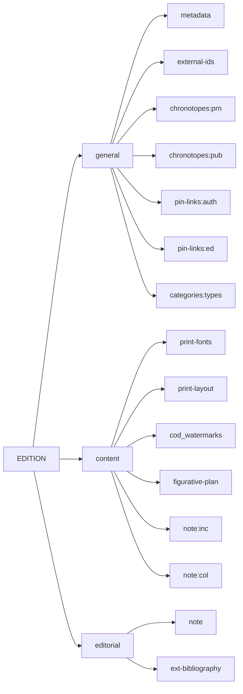
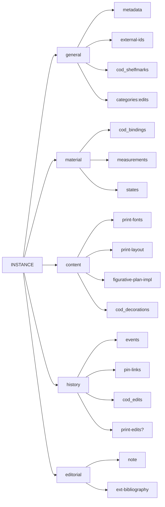

# Cadmus NDP Books

- [Cadmus models reference](https://myrmex.github.io/overview/cadmus/dev/models/)
- [Cadmus bricks playground](https://cadmus-bricks.fusi-soft.com/)
- [Cadmus NDP FRAC](https://github.com/vedph/cadmus-ndp-frac)
- [Cadmus NDP Drawings](https://github.com/vedph/cadmus-ndp-drawings)

In what follows:

- 🟢 marks a [general](https://vedph.github.io/cadmus-doc/models/shared.html#general) or bibliographic part.
- 📖 marks a [codicology](https://vedph.github.io/cadmus-doc/models/shared.html#codicology) part.
- 🪨 marks an [epigraphy](https://vedph.github.io/cadmus-doc/models/shared.html#epigraphy) part.
- ⭐ marks a new part. The star is used once, even when that part is then reused in other items. If a part marked with a star has a link to documentation, this means that I have already implemented it as I could do this in advance for generic parts. All the other parts are still to be implemented.
- ⚠️ marks an area where the model must still be defined with a discussion.

## New Parts

### PrintFontsPart

This part contains the fonts used in the printed book, each with its features and distribution across the book sections.

- ⭐ `fonts` (`PrintFont[]`):
  - `eid` (`string`)
  - `family`\* (`string` 📚 `print-font-families`): a descriptive ID like "R5" for the font family.
  - `sections` (`string[]` 📚 `print-layout-sections`, fieldset: title, body, comment, proem, other): the section(s) where the font is used.
  - `features` (`string[]` 📚 `print-font-features` flags, features of the font, especially useful when the family can't be specified: uppercase, lowercase, Roman, Gothic, Italic, Hebrew, Greek, Glagolitic, etc.)
  - `ids` ([AssertedCompositeId[]](https://github.com/vedph/cadmus-bricks-shell-v3/blob/master/projects/myrmidon/cadmus-refs-asserted-ids/README.md#asserted-composite-ids)): external identifiers for the font.
  - `note` (`string`)

>[Asserted composite ID brick demo](https://cadmus-bricks-v3.fusi-soft.com/refs/asserted-composite-id) - [flags brick demo](https://cadmus-bricks-v3.fusi-soft.com/ui/flag-set).

### PrintLayoutPart

This part contains the description of the print layout. This is similar to the [codicological layout part](https://github.com/vedph/cadmus-codicology/blob/master/docs/cod-layouts.md).

- ⭐ `PrintLayoutPart`:
  - `sheetFormats` (`string[]` 📚 `print-layout-formats`: folio (2º), quarto (4º), octavo (8º), duodecimo (12º), duodecimo large (12º l), sextodecimo (16º), octodecimo (18º), vigesimo-quarto (24º), trigesimo-secundo (32º), other)
  - `counts` (`DecoratedCount[]` 📚 `print-layout-counts`: sheets, columns, single-sheet (carte di tavola)): counts for columns, sheets, etc.
  - `formula` (`string`, a [layout formula](https://github.com/vedph/cod-layout-view) to be formalized, e.g. `[i–iii]8 χ6 a10 b8 c-e10 f8 g10 h-i8 l10 m-n8 o-r10 s6; 2a-2g10 2h12 2l-2m10 2o6; A8 B-H10⁰ I6 L12`, `&8 a-i8 k6 l-r8 2a-2m8 2n4 A6 B8 C-L6 (L6 bianca)`, `π10 a-z8 &8 [con]8 [rum]8 A8 B6 C-I8 K6 L8`, etc.). The basis is <https://norme.iccu.sbn.it/index.php?title=Guida_antico/Appendici/Appendice_C>.
  - `dimensions` (`PhysicalDimension[]`): dimensions (margins, columns, etc.), either extracted from the formula or manually added.
  - `features` (`string[]` 📚 `print-layout-features`): various relevant features in layout like e.g. drop caps, framed text, etc.
  - `note` (`string`)

>[Physical dimension brick demo](https://cadmus-bricks-v3.fusi-soft.com/mat/physical-dimension).

### FigurativePlanPart

This part describes the figurative plan for the book, in general terms and for each item composing the figurative plan. As a plan, it is an _abstraction_ as well as the edition. Departures from this plan are described in the `FigurativePlanImplPart` part, which is an implementation of the plan for a specific print instance.

- ⭐ `FigurativePlanPart`:
  - `artistIds` ([AssertedCompositeId[]](https://github.com/vedph/cadmus-bricks-shell-v3/blob/master/projects/myrmidon/cadmus-refs-asserted-ids/README.md#asserted-composite-ids)): artists identifiers, from external or internal resources, or even simple arbitrary names for unindentified artists.
  - `techniques`\* (`string[]` 📚 `fig-plan-techniques`: copper engraving, woodcut, lithograph, etching, other).
  - `items` (`FigPlanItem[]`): ordered list of items (illustrations, initials, etc.):
    - `eid`\* (`string`): a conventional human-friendly ID for the item.
    - `type`\* (`string` 📚 `fig-plan-types`: illustration, initial, scheme, diagram, frieze): type.
    - `citation` (`string`): this is a cross-project citation created according to some convention to link the figurative item to a textual passage.
  - `description` (`string`): free text description of the figurative plan.
  - `features` (`string[]` 📚 `fig-plan-features`): any set of relevant features tagged for the plan.

### FigurativePlanImplPart

Implementation of a figurative plan. This contains some general data about the implementation, and specific data for each item of the implementation which with reference to the plan was changed, removed, or added.

- ⭐ `FigurativePlanImplPart`:
  - `complete`\* (`boolean`): true if the implementation is complete with reference to the plan.
  - `techniques` ⬆️ (`string[]`): specified only to override the corresponding techniques in the plan. If no technique is specified, all the plan's techniques are implied. If any technique is specified, this implies that these techniques fully replace the plan's techniques.
  - `items` (`FigPlanItemImpl[]`): ordered list of items (illustrations, initials, etc.). Only those items which override the plan's items are specified here. If an item is not specified, it is assumed that the implementation is the same as in the plan:
    - `eid`\* (`string`): the ID of the corresponding figurative plan item when overriding it, or a new one if added in this instance.
    - `type` (`string` 📚 `fig-plan-types`: illustration, initial, scheme, diagram, frieze): type. This overrides the plan's type.
    - `citation` (`string`): this is a cross-project citation created according to some convention to link the figurative item to a textual passage. This overides the plan's citation.
    - `location` (`string`): the page location.
    - `change`\* (`string`: 📚 `fig-plan-impl-changes`: none, add, delete, replace, reuse, change, misuse): this describes the type of change made to the item in this instance with respect to the plan. If an item is deleted, it will just include `eid` and change type. If it is replaced, it will have the same `eid` and different content, overriding the plan. If it is added, it will have a new `eid` and its own content, totally missing from the plan.
    - `features` (`string[]` 📚 `fig-plan-impl-item-features`: original block change, frame added, frame removed, frame changed, other): any relevant features of the implemented item, e.g. a frame.
    - `matrixType` (`string` 📚 `fig-plan-impl-matrix-types`): woodblock, etc.
    - `matrixState` (`string` 📚 `fig-plan-impl-matrix-states`: fine, good, fair, damaged): the state of the matrix (e.g. a woodblock) used to print this item.
    - `matrixStateDsc` (`string`): a free textual description of the matrix state.
    - `position` (`string` 📚 `fig-plan-impl-positions`: in-text, upper margin, lower margin, full page, antiporta/frontispiece, single-sheet prints (carta di tavola)): the relative position of the item in the page.
    - `size` ([PhysicalSize](https://github.com/vedph/cadmus-bricks-shell-v3/blob/master/projects/myrmidon/cadmus-mat-physical-size/README.md))
    - `labels` (`FigPlanLabel[]`): the label types found in the item: e.g. a legend for the whole image, or a character name on a character in the image, etc.:
      - `type` (`string` 📚 `fig-plan-impl-labels`: legend, topographic indication, character name, inscription): the label type.
      - `fonts` (`PrintFont[]`): the fonts used in the label.
    - `labelDsc` (`string`): a free textual description of label(s).
    - `iconographyId` (`AssertedCompositeId`): link to the corresponding iconography item if any.
  - `description` (`string`): free text description of the figurative plan implementation.
  - `features` ⬆️ (`string[]` 📚 `fig-plan-impl-features`: centre, frame, initial, frieze): this overrides the plan's features. If not specified, all the plan's features are implied. If any feature is specified, this implies that these features fully replace the plan's features.

## PrintEdition Item

The print edition is an _abstraction_, defined from at least 1 print instance.

- general:
  - 🟢 [MetadataPart](https://github.com/vedph/cadmus-general/blob/master/docs/metadata.md)
  - 🟢 [ExternalIdsPart](https://github.com/vedph/cadmus-general/blob/master/docs/external-ids.md)
  - 🟢 [ChronotopesPart:prn](https://github.com/vedph/cadmus-general/blob/master/docs/chronotopes.md): print date(s) and place(s).
  - 🟢 [ChronotopesPart:pub](https://github.com/vedph/cadmus-general/blob/master/docs/chronotopes.md): published date(s) and place(s).
  - 🟢 [PinLinksPart](https://github.com/vedph/cadmus-general/blob/master/docs/pin-links.md)`:auth`: authors.
  - 🟢 [PinLinksPart](https://github.com/vedph/cadmus-general/blob/master/docs/pin-links.md)`:ed`: editors.
  - 🟢 [CategoriesPart:type](https://github.com/vedph/cadmus-general/blob/master/docs/categories.md)

>[Chronotopes brick demo](https://cadmus-bricks-v3.fusi-soft.com/refs/asserted-chronotope-set).

- content:
  - ⭐ [PrintFontsPart](#printfontspart)
  - ⭐ [PrintLayoutPart](#printlayoutpart)
  - 📖 [COD watermarks](https://github.com/vedph/cadmus-codicology/blob/master/docs/cod-watermarks.md)
  - 🟢 [FigurativePlanPart](#figurativeplanpart)
  - 🟢 [NotePart:inc](https://github.com/vedph/cadmus-general/blob/master/docs/note.md) for transcribing incipit's text.
  - 🟢 [NotePart:col](https://github.com/vedph/cadmus-general/blob/master/docs/note.md) for transcribing incipit's colophon.

- editorial:
  - 🟢 [NotePart](https://github.com/vedph/cadmus-general/blob/master/docs/note.md) for a generic note
  - 🟢 [ExtBibliographyPart](https://github.com/vedph/cadmus-general/blob/master/docs/ext-bibliography.md)

## PrintInstance Item

- general:
  - 🟢 [MetadataPart](https://github.com/vedph/cadmus-general/blob/master/docs/metadata.md)
  - 🟢 [ExternalIdsPart](https://github.com/vedph/cadmus-general/blob/master/docs/external-ids.md)
  - 📖 [COD shelfmarks](https://github.com/vedph/cadmus-codicology/blob/master/docs/cod-shelfmarks.md)

- material:
  - 📖 [COD bindings](https://github.com/vedph/cadmus-codicology/blob/master/docs/cod-bindings.md)
  - 🟢 [PhysicalMeasurementsPart](https://github.com/vedph/cadmus-general/blob/master/docs/physical-measurements.md)
  - 🟢 [PhysicalStatesPart](https://github.com/vedph/cadmus-general/blob/master/docs/physical-states.md)

- content:
  - ⭐ [PrintLayoutPart](#printlayoutpart) for overriding
  - ⭐ [FigurativePlanImplPart](#figurativeplanimplpart)
  - 🟢 [CategoriesPart:edits](https://github.com/vedph/cadmus-general/blob/master/docs/categories.md): postille
  - 📖 [COD CodDecorationsPart](https://github.com/vedph/cadmus-codicology/blob/master/docs/cod-decorations.md)

- history:
  - 🟢 [HistoricalEventsPart](https://github.com/vedph/cadmus-general/blob/master/docs/historical-events.md)
  - 🟢 [PinLinksPart](https://github.com/vedph/cadmus-general/blob/master/docs/fr.pin-links.md)
  - 📖 [COD CodEditsPart](https://github.com/vedph/cadmus-codicology/blob/master/docs/cod-edits.md)

- editorial:
  - 🟢 [NotePart](https://github.com/vedph/cadmus-general/blob/master/docs/note.md) for generic note
  - 🟢 [ExtBibliographyPart](https://github.com/vedph/cadmus-general/blob/master/docs/ext-bibliography.md)
